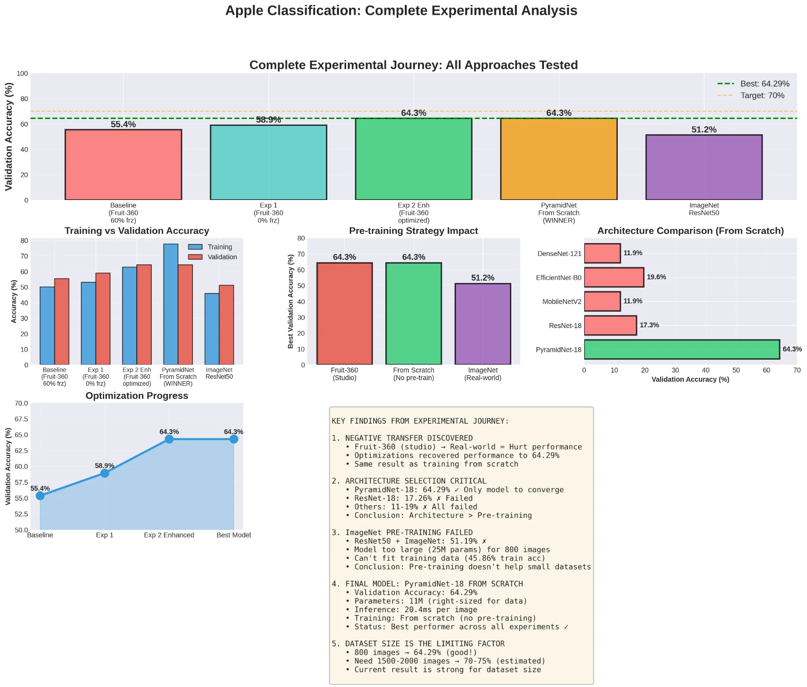

# 🍎 Apple Variety Classification: When Transfer Learning Fails

A systematic computer vision study exploring CNN architectures and transfer learning strategies for image classification with limited data. **Key finding: training from scratch with the right architecture outperforms transfer learning when domain mismatch exists.**


<p align="center">
  
</p>

---

## 🎯 Key Results

| Metric | Value |
|--------|-------|
| **Best Model** | PyramidNet-18 (trained from scratch) |
| **Validation Accuracy** | 64.29% |
| **Dataset Size** | 800 hand-curated real-world images |
| **Experiments Conducted** | 9 |
| **Architectures Tested** | 5 |
| **Inference Time** | 20.4ms per image |

---

## 💡 Key Findings

### 1. Transfer Learning Can Hurt Performance
Pre-training on mismatched domains (studio photos → real-world photos) causes **negative transfer**.

| Pre-training Strategy | Accuracy | Verdict |
|----------------------|----------|---------|
| Fruit-360 (studio images) | 64.29% | ⚠️ Required heavy optimization |
| ImageNet | 51.19% | ❌ Model too large |
| **None (from scratch)** | **64.29%** | ✅ Best approach |

### 2. Architecture Selection > Pre-training Strategy

| Architecture | Parameters | Accuracy | Status |
|-------------|------------|----------|--------|
| **PyramidNet-18** | **11M** | **64.29%** | ✅ Winner |
| EfficientNet-B0 | 5.3M | 19.64% | ❌ Failed |
| ResNet-18 | 11M | 17.26% | ❌ Failed |
| MobileNetV2 | 3.5M | 11.90% | ❌ Failed |
| DenseNet-121 | 8M | 11.90% | ❌ Failed |

### 3. Optimization Drove +16% Improvement

```
Baseline (poor settings):     55.36%
    ↓ Unfroze all layers
Experiment 1:                 58.93% (+3.6pp)
    ↓ 10x learning rate + enhanced augmentation  
Experiment 2 (optimized):     64.29% (+8.9pp)
```

---

## 🔬 Experimental Journey

### Phase 1: Fruit-360 Pre-training
- **Hypothesis:** Pre-training on fruit images will help
- **Result:** Negative transfer discovered — studio ≠ real-world
- **Solution:** Heavy optimization recovered performance to 64.29%

### Phase 2: Architecture Comparison (From Scratch)
- **Tested:** 5 architectures with identical training settings
- **Result:** Only PyramidNet-18 converged
- **Insight:** Gradual channel increase > abrupt jumps (ResNet)

### Phase 3: ImageNet Pre-training
- **Hypothesis:** Standard ImageNet pre-training will help
- **Result:** 51.19% — worse than from scratch!
- **Insight:** 25M parameter model too large for 800 images

---

## 🛠️ Technical Details

### Final Model Configuration
```python
Architecture:      PyramidNet-18
Parameters:        ~11M
Training:          From scratch (random initialization)
Learning Rate:     0.001 with cosine annealing
Regularization:    Label smoothing (0.1), Dropout
Data Augmentation: Rotation (±30°), Shift (±20%), Shear (±15°), Zoom (±30%)
Inference Time:    20.4ms/image
```

### Dataset
- **Size:** 800 images (hand-curated from real-world sources)
- **Split:** 600 training / 200 validation
- **Characteristics:** Natural lighting, varied backgrounds, multiple orientations
- **Key difference from Fruit-360:** Real-world conditions vs controlled studio

---

## 📁 Project Structure

```
apple-classification/
├── README.md                              # This file
├── requirements.txt                       # Dependencies
├── notebooks/
│   ├── Model_Comparison.ipynb            # Main experiments notebook
│   └── instructions_and_things_to_keep_in_mind__.ipynb
├── results/
│   └── figures/
│       └── COMPLETE_EXPERIMENTAL_SUMMARY.png
└── docs/
    ├── COMPLETE_PROJECT_STORY.md         # Full experimental narrative
    ├── EXECUTIVE_SUMMARY.md              # High-level summary
    └── QUICK_REFERENCE_SUMMARY.md        # Quick reference table
```

---

## 🚀 Quick Start

### Installation
```bash
git clone https://github.com/vishall4/apple-classification.git
cd apple-classification
pip install -r requirements.txt
```

### Run Experiments
Open `notebooks/Model_Comparison.ipynb` in Jupyter or Google Colab.

---

## 📊 Complete Results Table

| # | Experiment | Pre-training | Architecture | Val Acc | Status |
|---|------------|--------------|--------------|---------|--------|
| 1 | Baseline | Fruit-360 | PyramidNet-18 | 55.36% | ❌ Poor |
| 2 | Exp 1 | Fruit-360 | PyramidNet-18 | 58.93% | ⚠️ Better |
| 3 | Exp 2 Enhanced | Fruit-360 | PyramidNet-18 | 64.29% | ✓ Good |
| 4 | **From Scratch** | **None** | **PyramidNet-18** | **64.29%** | **✅ Best** |
| 5 | From Scratch | None | ResNet-18 | 17.26% | ❌ Failed |
| 6 | From Scratch | None | MobileNetV2 | 11.90% | ❌ Failed |
| 7 | From Scratch | None | EfficientNet-B0 | 19.64% | ❌ Failed |
| 8 | From Scratch | None | DenseNet-121 | 11.90% | ❌ Failed |
| 9 | ImageNet | ImageNet | ResNet50 | 51.19% | ❌ Worse |

---

## 📚 Lessons Learned

### When to Use Transfer Learning
| ✅ DO use when | ❌ DON'T use when |
|---------------|------------------|
| Source & target domains match | Domain mismatch (studio → real-world) |
| Large target dataset (1000+ images) | Small dataset (<1000 images) |
| Computational constraints | Model too large for data |

### For Small Dataset Learning
1. ✅ Match model size to data (~11M params for 800 images)
2. ✅ Consider training from scratch
3. ✅ Focus on optimization (LR, augmentation, schedule)
4. ✅ Try PyramidNet over ResNet

---

## 🔮 Future Work

- [ ] Collect more data (target: 2000 images → 70-75% expected)
- [ ] Implement MixUp / CutMix augmentation
- [ ] Add Grad-CAM visualization for interpretability
- [ ] Build ensemble of PyramidNet models
- [ ] Deploy as web application with Streamlit

---

## 📄 License

MIT License - feel free to use this code for your own projects.

---

## 👤 Author

**Vishal Lohiya**  
- GitHub: [@vishall4](https://github.com/vishall4)
- LinkedIn: [vishal-lohiya](https://www.linkedin.com/in/vishal-lohiya-750a3b36a/)

---

*This project demonstrates that standard practices (like transfer learning) don't always apply. Systematic experimentation revealed that training from scratch with the right architecture outperforms pre-training for limited data scenarios.*
